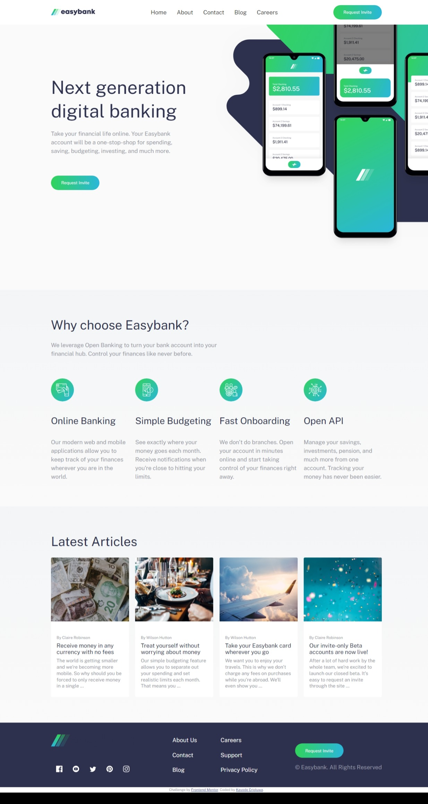

# Frontend Mentor - Easybank landing page solution

This is a solution to the [Easybank landing page challenge on Frontend Mentor](https://www.frontendmentor.io/challenges/easybank-landing-page-WaUhkoDN). Frontend Mentor challenges help you improve your coding skills by building realistic projects. 

## Table of contents

- [Frontend Mentor - Easybank landing page solution](#frontend-mentor---easybank-landing-page-solution)
  - [Table of contents](#table-of-contents)
  - [Overview](#overview)
    - [The challenge](#the-challenge)
    - [Screenshot](#screenshot)
    - [Links](#links)
  - [My process](#my-process)
    - [Built with](#built-with)
    - [Continued development](#continued-development)
    - [Useful resources](#useful-resources)
  - [Author](#author)

**Note: Delete this note and update the table of contents based on what sections you keep.**

## Overview

### The challenge

Users should be able to:

- View the optimal layout for the site depending on their device's screen size
- See hover states for all interactive elements on the page

### Screenshot

### Links

- Solution URL: [Add solution URL here](https://your-solution-url.com)
- Live Site URL: [Add live site URL here](https://your-live-site-url.com)

## My process

### Built with

- Semantic HTML5 markup
- CSS custom properties
- Flexbox
- CSS Grid
- Desktop-first workflow

### Continued development

While working on this project, I was reminded of how little javascript I know, I also encountered alot of issues while working on the css due to been away for a while. I would work on improving my knowledge on concepts; css-position, css-transition and animation, semantic css, javascript functions and the likes.

### Useful resources

- [8hour Basic JavaScript Course](https://youtu.be/EfAI9bwzVZk?si=36A6_7FEY37XY8Rq) - This helped me understand basic JS concepts. I really liked this pattern and will use it going forward.

## Author

- Frontend Mentor - [@Kayodejay](https://www.frontendmentor.io/profile/Kayodejay)
- Twitter - [@jaykayode529](https://www.twitter.com/jaykayode529)
